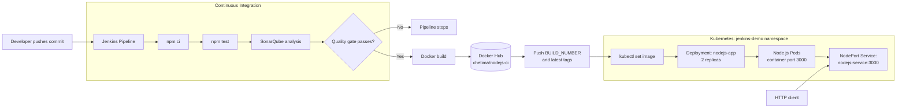

# Jenkins Node.js CI/CD

A small Node.js HTTP service used to demonstrate a complete CI/CD path with Jenkins, Docker, SonarQube, and Kubernetes.

The application responds with `Hello from Jenkins CI/CD!` on port `3000`. Every pipeline run installs dependencies, executes tests with coverage, checks the SonarQube quality gate, builds and publishes a versioned Docker image, and rolls that image out to Kubernetes.

## Architecture



## Repository Layout

| Path | Purpose |
| --- | --- |
| `server.js` | Starts the HTTP server on port `3000`. |
| `app.js` | Contains the exported `add` function used by the tests. |
| `test.js` | Jest test file and direct assertion checks. |
| `Dockerfile` | Creates the production image from Node.js 20 Alpine. |
| `Jenkinsfile` | Defines the install, test, analysis, image, and deployment stages. |
| `sonar-project.properties` | SonarQube project and exclusion settings. |
| `k8s/deployment.yaml` | Kubernetes Deployment with two replicas. |
| `k8s/service.yaml` | Kubernetes `NodePort` Service exposing port `3000`. |
| `k8s/jenkins-rbac.yaml` | Namespace-scoped permissions for the Jenkins deployer account. |

## Run Locally

### Prerequisites

- Node.js 20 or later
- npm

Install dependencies and start the service:

```bash
npm install
npm start
```

In another terminal, verify the response:

```bash
curl http://localhost:3000
```

Expected output:

```text
Hello from Jenkins CI/CD!
```

Stop the server with `Ctrl+C`.

## Test

Run the Jest suite with coverage:

```bash
npm test
```

The generated coverage report is written to `coverage/`.

## Build and Run with Docker

Build and run the container locally:

```bash
docker build -t jenkins-nodejs-ci:local .
docker run --rm -p 3000:3000 jenkins-nodejs-ci:local
```

Then request `http://localhost:3000` from the host.

## Kubernetes Deployment

Create the namespace before applying the manifests if it does not already exist:

```bash
kubectl create namespace jenkins-demo --dry-run=client -o yaml | kubectl apply -f -
kubectl apply -f k8s/jenkins-rbac.yaml
kubectl apply -f k8s/deployment.yaml
kubectl apply -f k8s/service.yaml
```

Check the rollout and service:

```bash
kubectl rollout status deployment/nodejs-app -n jenkins-demo
kubectl get pods -n jenkins-demo -l app=nodejs-app
kubectl get service nodejs-service -n jenkins-demo
```

The Service is configured as a `NodePort`, so the exact external port is assigned by the cluster. Retrieve it with:

```bash
kubectl get service nodejs-service -n jenkins-demo
```

## Jenkins Pipeline

The `Jenkinsfile` expects the Jenkins agent to provide:

- A configured Node.js installation named `NodeJS-20`
- A SonarQube installation named `SonarQube`
- A SonarScanner tool named `SonarScanner`
- Docker and `kubectl` CLIs
- A username/password credential named `dockerhub-credentials`
- Kubernetes access to the `jenkins-demo` namespace

Pipeline stages:

1. Report branch and build information.
2. Install dependencies with `npm ci`.
3. Run `npm test`.
4. Run SonarQube analysis and wait for the quality gate.
5. Build `chetima/nodejs-ci` with the build number and `latest` tags.
6. Push both tags to Docker Hub.
7. Update `nodejs-app` and wait for the Kubernetes rollout.
8. List the resulting Deployment and Pods.

The pipeline disables concurrent builds, keeps the last 10 builds, and applies a 20-minute overall timeout. The build number is used as the immutable deployment tag; `latest` is also published for convenience.

## Configuration Notes

- The HTTP server currently returns the same plain-text response for every request.
- The application listens on all container interfaces through Node's default HTTP server binding, making it reachable through the Kubernetes Service.
- `k8s/deployment.yaml` contains a sample image tag. Jenkins replaces it during `Deploy Production` with the current build tag.
- The Kubernetes RBAC manifest grants the Jenkins service account permissions only within the `jenkins-demo` namespace.


